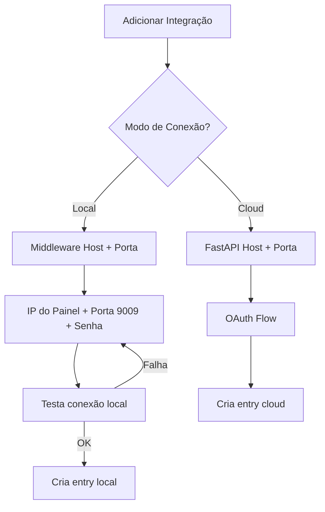
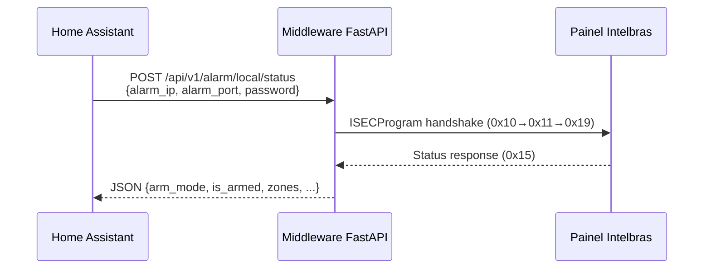

# Home Assistant — Conexão Local (ISECProgram)

## Sumário

O componente Home Assistant `intelbras_guardian` suporta conexão local direta com o painel de alarme Intelbras via protocolo ISECProgram (porta 9009), eliminando a dependência da nuvem Guardian.

Este documento descreve a arquitetura, configuração e funcionamento do modo local.

## Arquitetura

### Arquivos do Componente

| Arquivo | Responsabilidade |
|---------|-----------------|
| `const.py` | Constantes de configuração (modo, IP, porta, senha) |
| `api_client.py` | Métodos locais (`_request_local`, `get_local_status`, `arm_local`, `disarm_local`, `test_local_connection`) |
| `config_flow.py` | Seletor Cloud/Local + formulário local (IP+porta+senha) |
| `__init__.py` | Branch de setup — local pula OAuth/session |
| `coordinator.py` | `_async_update_data_local()` + helpers `arm_partition()`/`disarm_partition()` |
| `alarm_control_panel.py` | Chamadas arm/disarm roteadas via coordinator |
| `strings.json` | Strings para steps user/cloud/local |
| `translations/en.json` | Tradução inglês |
| `translations/pt-BR.json` | Tradução português |

### Fluxo de Configuração



### Fluxo de Dados (modo local)



## Configuração

### Pré-requisitos

1. Middleware FastAPI Guardian rodando (Docker ou local)
2. Painel Intelbras na mesma rede local
3. Porta 9009 do painel acessível pelo middleware
4. Senha de acesso remoto de 6 dígitos (não é a senha master)

### Passo a Passo

1. No Home Assistant, vá em **Settings → Devices & Services → Add Integration**
2. Busque por **Intelbras Guardian**
3. Escolha **Local (LAN direto)** como modo de conexão
4. Preencha:
   - **Middleware Host**: IP do servidor FastAPI (ex: `192.168.1.100`)
   - **Middleware Port**: Porta do FastAPI (padrão: `8000`)
   - **IP do Painel**: IP da central Intelbras (ex: `192.168.1.5`)
   - **Porta do Painel**: `9009` (padrão ISECProgram)
   - **Senha**: Senha de acesso remoto de 6 dígitos
5. A integração testará a conexão automaticamente

### Constantes (`const.py`)

```python
CONF_CONNECTION_MODE = "connection_mode"
CONF_ALARM_IP = "alarm_ip"
CONF_ALARM_PORT = "alarm_port"
CONF_ALARM_PASSWORD = "alarm_password"
CONNECTION_MODE_CLOUD = "cloud"
CONNECTION_MODE_LOCAL = "local"
DEFAULT_ALARM_PORT = 9009
```

## Funcionamento

### Polling

O coordinator usa `_async_update_data_local()` que chama `client.get_local_status()` a cada ciclo (1s por padrão). O endpoint do middleware (`/api/v1/alarm/local/status`) realiza o handshake ISECProgram completo a cada chamada.

### Arm/Disarm

Todas as chamadas de arm/disarm em `alarm_control_panel.py` passam pelos helpers do coordinator:

```python
# coordinator.py
async def arm_partition(self, device_id, partition_id, mode="away"):
    if self._is_local:
        return await self.client.arm_local(...)
    return await self.client.arm_partition(...)
```

### Diferenças vs Cloud

| Funcionalidade | Cloud | Local |
|---------------|-------|-------|
| Autenticação | OAuth + session_id | Senha de 6 dígitos |
| Polling | ISECNet via cloud | ISECProgram direto |
| SSE (eventos real-time) | ✅ | ❌ (apenas polling) |
| Zonas | ✅ | ✅ |
| Arm/Disarm | ✅ | ✅ |
| Bypass | ✅ | ❌ (não implementado) |
| Siren off | ✅ | ❌ (não implementado) |
| Múltiplos dispositivos | ✅ | 1 por entry |

## Troubleshooting

### Erro "Falha na conexão local"

- Verifique se o painel está acessível na rede: `ping <IP_PAINEL>`
- Verifique se a porta 9009 está aberta: `nc -zv <IP_PAINEL> 9009`
- Confirme que a senha é a de **acesso remoto** (6 dígitos), não a master (4 dígitos)
- Verifique se não há outro cliente conectado (AMT Mobile, AMT Remoto) — a central só permite uma conexão por vez

### Erro "Cannot connect to FastAPI middleware"

- Verifique se o container Docker do middleware está rodando
- Confirme o host/porta do middleware
